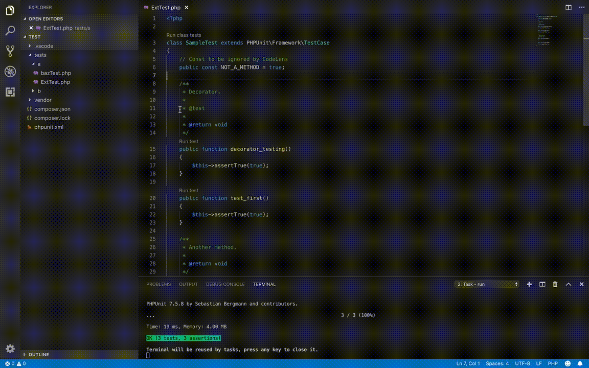

[](https://travis-ci.org/danilopolani/vscode-yet-another-phpunit)
[](https://marketplace.visualstudio.com/items?itemName=danilopolani.yet-another-phpunit)


# Yet Another PHPUnit

This extension is an enhanced fork-n-remake of [Better PHPUnit](https://github.com/calebporzio/better-phpunit). The major part of the code is taken from that repository.  

## Installation

[Download it from the Marketplace](https://marketplace.visualstudio.com/items?itemName=danilopolani.yet-another-phpunit) or search for **Yet Another PHPUnit** in your VSCode editor extension panel.



## Features
- Color output!
- [**SSH** support](#ssh)
- [**Docker** support](#docker)
- Run individual methods
- Run a single file
- Run tests inside a folder
- Run all the tests
- Test failures are displayed in the "Problems" panel for quick access
- CodeLens to run single tests just in one click

> Note: this plugin registers "tasks" to run phpunit, not a command like other extensions. This makes it possible to leverage the problem output and color terminal.

### Run a test method:
- Click `Run test` above the method name  
_or_
- Place your cursor on the method name, open the command menu with `cmd+shift+p` and select `Yet PHPUnit: Run`

### Run a test file:
- Click `Run class tests` above the class name  
_or_
- Right click on the file in the _"Explorer"_ tab on the left sidebar and select `Run File Tests`  
_or_
- Place your cursor on the class name, open the command menu with `cmd+shift+p` and select `Yet PHPUnit: Run`

### Run a folder tests:
- Right click on the folder in the _"Explorer"_ tab on the left sidebar and select `Run Tests Inside Folder`

### Run all the tests:
- Open the command menu: `Cmd+Shift+p`
- Select: `Yet PHPUnit: Run All`

### Re-run last executed test:
- Open the command menu: `Cmd+Shift+p`
- Select: `Yet PHPUnit: Re-Run Test`

## Global configuration variables

| Name | Type | Default | Description |
|------|------|---------|-------------|
| `yet-phpunit.commandSuffix` | string | `null` | Content (flags, arguments) to be appended to PHPUnit command. For example, if you want to use `--testdox` this is the correct place. |
| `yet-phpunit.phpunitBinary` | string | `null` | A custom path of PHPUnit binary file. By default it will be auto-discovered from `vendor` folder. |
| `yet-phpunit.codelens` | boolean | `true` | Set it to `false` to disable Code Lens, namely the clickable label _"Run test"_ above methods and classes. |

### How to use these values

Open your settings (or Workspace settings), switch to JSON and put them like this:

```
{
    "yet-phpunit.commandSuffix": null,
    "yet-phpunit.phpunitBinary": null,
    "yet-phpunit.codelens": true
}
```

## SSH configuration

Variables to set up tests over SSH (for VMs like Laravel Homestead):

| Name | Type | Default | Description |
|------|------|---------|-------------|
| `yet-phpunit.ssh.enable` | boolean | `false` | Set it to `true` to enable SSH. |
| `yet-phpunit.ssh.binary` | string | `ssh` | Custom SSH agent binary, for example `plink.exe` (PuTTY ssh). |
| `yet-phpunit.ssh.host` | string | `null` | SSH hostname. |
| `yet-phpunit.ssh.user` | string | `null` | SSH username. |
| `yet-phpunit.ssh.port` | number | `22` | SSH port. |
| `yet-phpunit.ssh.options` | string | `null` | Additional SSH options (arguments, flags etc.). |
| `yet-phpunit.ssh.shellAppend` | string | `null` | Stuff to append after the SSH and PHPUnit command. For example, to enable color on Windows this is the right place. |
| `yet-phpunit.ssh.paths` | object | `{}` | The SSH path map. Keys are local (host) paths and values are remote (guest) paths. |

### Example of configuration
> If you use PuTTy, you have to use `plink` as binary file (it's part of with PuTTy)

```
{
    "yet-phpunit.ssh.enable": true,
    "yet-phpunit.ssh.binary": "plink.exe",
    "yet-phpunit.ssh.host": "host",
    "yet-phpunit.ssh.user": "user",
    "yet-phpunit.ssh.port": "22",
    "yet-phpunit.ssh.options": null,
    "yet-phpunit.ssh.shellAppend": null,
    "yet-phpunit.ssh.paths": {
        "/your/local/path": "/your/remote/path"
    }
}
```

## Docker

Variables to set up tests in a Docker container:

| Name | Type | Default | Description |
|------|------|---------|-------------|
| `yet-phpunit.docker.enable` | boolean | `false` | Set it to `true` to enable Docker support. |
| `yet-phpunit.docker.command` | string | `null` | Command base for Docker, for example `docker exec your-container`. This is required if you enable Docker. |
| `yet-phpunit.docker.paths` | object | `{}` | The SSH path map. Keys are local (host) paths and values are remote (guest) paths. |

### Example of configuration

#### Example of configuration for an already running Container:

```
{
    "yet-phpunit.docker.enable": true,
    "yet-phpunit.docker.command": "docker exec <container-name>",
    "yet-phpunit.docker.paths": {
        "/your/local/path": "/your/remote/path"
    },
}
```

#### Example of configuration to start up a container with Docker Compose and kill it when finished:

```
{
    "yet-phpunit.docker.enable": true,
    "yet-phpunit.docker.command": "docker-compose run --rm <container-name>",
    "yet-phpunit.docker.paths": {
        "/your/local/path": "/your/remote/path"
    },
}
```

> Tip: if you want to run Docker over a SSH session just should use both options `ssh.enable` and `docker.enable` together.

## Roadmap: what's next?
This is what I'd love to implement in the future:

- Run a single suite tests
- Panel on left sidebar to see suites and available tests
- Re-run failures

### Credits
- Logo by <div> by FlatIcon is licensed by [CC 3.0 BY](http://creativecommons.org/licenses/by/3.0/)
- Starting code forked from [Better PHPUnit](https://github.com/calebporzio/better-phpunit)
